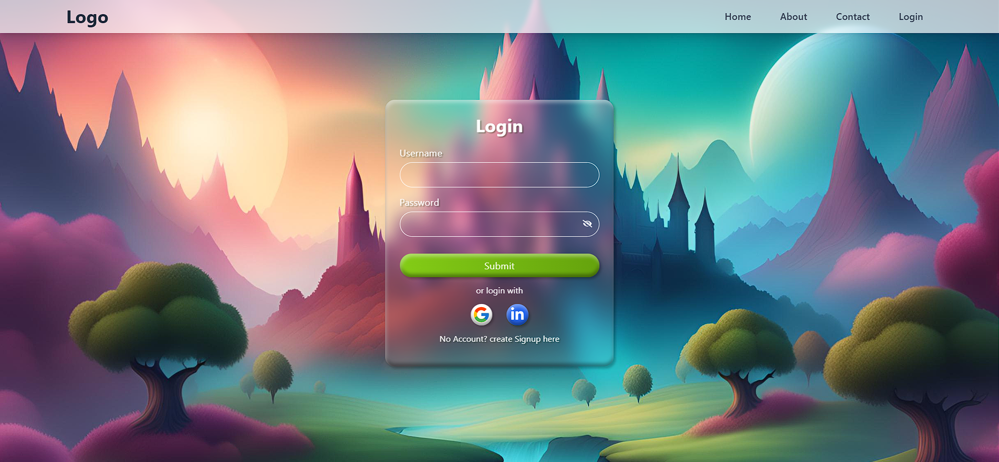

# Proyecto Login y Registro con React, Vite y Tailwind CSS

   

## 🛠️ Tecnologías Utilizadas

Este proyecto utiliza las siguientes tecnologías:

- [React](https://reactjs.org/): Biblioteca para crear interfaces de usuario
- [Vite](https://vitejs.dev/): Herramienta de construcción rápida
- [Tailwind CSS](https://tailwindcss.com/): Framework CSS utilitario para estilización
- [Framer Motion](https://www.framer.com/motion/): Biblioteca para animaciones en React

---

## 🚀 Demostración




---

## ⚙️ Cómo Ejecutar el Proyecto Localmente

Sigue las instrucciones a continuación para configurar y ejecutar el proyecto en tu entorno local.

### Requisitos Previos
Asegúrate de tener los siguientes elementos instalados:

- [Node.js](https://nodejs.org/) (versión 16 o superior recomendada)
- [npm](https://www.npmjs.com/) o [yarn](https://yarnpkg.com/)

### Pasos para la Instalación

1. Clona este repositorio:

```bash
git clone https://github.com/tu-usuario/tu-repositorio.git
```

2. Accede al directorio del proyecto:

```bash
cd tu-repositorio
```

3. Instala las dependencias:

Si utilizas npm:
```bash
npm install
```

O con yarn:
```bash
yarn
```

4. Ejecuta el servidor de desarrollo:

Si utilizas npm:
```bash
npm run dev
```

O con yarn:
```bash
yarn dev
```

5. Abre en el navegador:

Normalmente, el proyecto estará disponible en: `http://localhost:5173`

---

## 🌟 Funcionalidades Principales

- **Funcionalidad 1**: [Una interfaz impactante y atractiva para la pantalla de inicio de sesión.]
- **Funcionalidad 2**: [Registro de usuarios con un diseño intuitivo y funcional.]

---

## 🖌️ Estilización con Tailwind CSS

Los estilos de este proyecto se crearon con **Tailwind CSS**, facilitando el diseño responsivo y personalizaciones rápidas. Puedes añadir tus propios estilos en `src/styles`.

---

## 🧩 Estructura del Proyecto

```bash
┌── src/
│   ├── components/   # Componentes reutilizables
│   ├── pages/        # Páginas principales
│   ├── styles/       # Configuración de Tailwind
│   ──── App.jsx     # Archivo principal
```

---

Hecho por [YagoCastelao](https://github.com/YagoCastelao)

